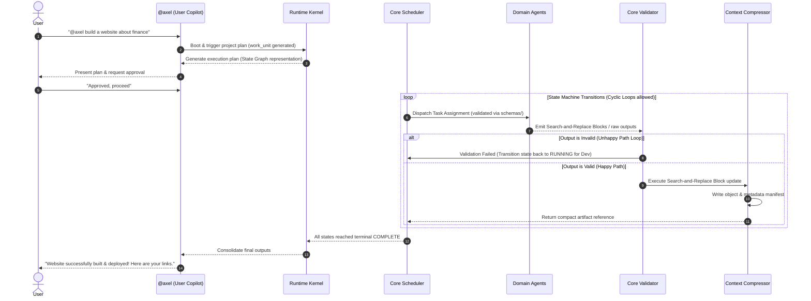

# LIEM: Enterprise Multi-Agent Orchestrator

Welcome to **LIEM**, a mass-scale, production-ready Multi-Agent system designed to automate the entire software development lifecycle (SDLC), business planning, data engineering, marketing, and security operations.

LIEM is built entirely on a **Declarative Agent Skill Model**. All agent behaviors, system prompts, operational protocols, and output formats are configured in clean, modular Markdown (`.md`) files. This allows the system to be engine-agnostic—any external LLM framework or custom parser can easily ingest these skills.

---

## 🏗️ Modular Core Architecture

To prevent context window bloat and single-point-of-failure issues, the system divides operations between a **Control Plane** and a **Data Plane**, managed by a central **Runtime Kernel**:

```text
                               +-------------------------------------+
                               |             User Input              |
                               +-------------------------------------+
                                                  |
                                                  v
                               +-------------------------------------+
                               |        @axel (User Copilot)         |
                               +-------------------------------------+
                                                  |
                                                  v
                               +-------------------------------------+
                               |            Runtime Kernel           |
                               |  (VRAM Offloading & Pub/Sub Event)  |
                               +-------------------------------------+
                                                  |
                     +----------------------------+----------------------------+
                     |                                                         |
                     v                                                         v
         [ CONTROL PLANE ]                                              [ DATA PLANE ]
    Planner ──> Router (Deterministic lookup)                         Executor (Sandbox & WAL DB)
                 ↓                                                             ↓
             Scheduler (Decaying Temp loop breaker)                         Providers (LLM/Storage)
                 ↓                                                             ↓
             Validator (JSON contracts & Pause-and-Resume)                  Artifacts (AST & Search/Replace Blocks)
```

### 1. The Runtime Kernel ([event_loop.md](file:///d:/Liem%20OS2/liem-os/kernel/event_loop.md))
The central engine that owns the system lifecycle (booting, executing event loops, checkpointing snapshots, and shut downs).
- **Model Offloading (Scale-to-Zero VRAM)**: To run on consumer hardware (e.g. 8GB VRAM), LLMs of suspended agents are dynamically unloaded to system RAM, freeing GPU slots for active ones.
- **Event-Driven Pub/Sub**: Prevents database polling loops; workers publish IPC/WebSocket events (`task.status.completed`) to instantly wake up the Scheduler.

### 2. The Control Plane (Coordination & Design)
- **User Copilot ([axel.md](file:///d:/Liem%20OS2/liem-os/agents/axel.md))**: Primary conversational interface.
- **Core Planner ([planner.md](file:///d:/Liem%20OS2/liem-os/agents/core/planner.md))**: Decomposes requests into work units.
- **Core Router ([router.md](file:///d:/Liem%20OS2/liem-os/agents/core/router.md))**: Resolves task capabilities to specific agent skills deterministically using YAML parsers on `registry/agents.yaml`.
- **Core Scheduler ([scheduler.md](file:///d:/Liem%20OS2/liem-os/agents/core/scheduler.md))**: Coordinates execution sequences using a **Reactive State Machine** for cyclic loops. Implements **Decaying Temperature & Loop Breakers** (loops limited to 5 retries, decaying temperature by 0.15 per retry to ensure convergence, escalating to model fallback, HITL, or re-planning).
- **Core Validator ([validator.md](file:///d:/Liem%20OS2/liem-os/agents/core/validator.md))**: Validates payloads against schemas under `schemas/` and manages **Pause-and-Resume State Hydration** (suspends states to disk and frees leases during HITL).

### 3. The Data Plane (Execution & Assets)
- **Core Executor ([executor.md](file:///d:/Liem%20OS2/liem-os/agents/core/executor.md))**: Runs tasks inside `sandbox/policy.yaml` boundaries, updating states asynchronously via a **Write-Ahead Logging (WAL)** database transaction model to prevent IO concurrency bottlenecks.
- **Context Compressor ([context_agent.md](file:///d:/Liem%20OS2/liem-os/agents/core/context_agent.md))**: Uses **AST (Abstract Syntax Tree) Chunking**, **Search-and-Replace Blocks**, and **AST Node ID Injections** to allow developer agents to edit code without line-number offset or patch hallucinations. Standard line-number-based Git patches are prohibited.
- **Recovery Manager ([recovery_agent.md](file:///d:/Liem%20OS2/liem-os/agents/core/recovery_agent.md))**: Manages circuit breakers (CLOSED, OPEN, HALF_OPEN) and fallbacks.


---

## 📂 Project Directory Structure

```text
LIEM/
│
├── src/                            # Fully implemented Python runtime driver
│   ├── main.py                     # System entrypoint & verification pipeline
│   ├── agents/                     # Base agent parsers & context compression
│   ├── kernel/                     # Event loop, scheduler, event bus, & VRAM offloader
│   └── storage/                    # Database interface & SQLite WAL state store
│
├── kernel/                         # Central execution engine & loop configs
│   ├── event_loop.md               # Boot, event loop, offloading, and recovery logic
│   ├── interfaces.yaml             # Execution and provider API specifications
│   └── admission.yaml              # SLA queues, priority triggers, and concurrency gates
│
├── agents/                         # Declarative Agent Skills (Markdown definitions)
│   ├── core/                       # Orchestration & System agents
│   ├── swe/                        # Software Engineering Domain
│   ├── research/                   # Research & Analysis Domain
│   ├── security/                   # Security Domain
│   ├── creative/                   # Content Creative Domain
│   ├── business/                   # Business Operations Domain
│   ├── support/                    # Customer Support & Ops Domain
│   ├── data/                       # Data Engineering & Analytics Domain
│   ├── hr/                         # HR & Talent Management Domain
│   ├── integration/                # Product Integration & Ecosystem Domain
│   └── pm_agile/                   # Project Management & Agile Domain
│
├── runtime/                        # Persistent execution state store
│   ├── executions/                 # State machine execution traces
│   ├── tasks/                      # Active task queues and lease locks
│   ├── locks/                      # Concurrency locks
│   └── snapshots/                  # Suspended state snapshots (Scale-to-Zero)
│
├── artifacts/                      # Structured artifact storage (manifest & objects)
│   ├── manifest.yaml               # Metadata layout for outputs
│   └── objects/                    # Bulky text/code objects stored physically
│
├── memory/                         # Isolated memory spaces (working, episodic, semantic, project)
│
├── registry/                       # Capability, lifecycle, and version maps
│
├── events/                         # Versioned, immutable event schemas
│
├── telemetry/                      # Logs, metrics, and cost allocation dashboards
│
├── audit/                          # Immutable, append-only history logs
│
├── maintenance/                    # Housekeeping and garbage collection routines
│
├── compatibility/                  # Version control compatibility rules
│
├── deploy/                         # Automated deployment guidelines
│
├── schemas/                        # Formal JSON validation schemas (task, artifact, work_unit)
│   ├── task.schema.json
│   ├── artifact.schema.json
│   ├── event.schema.json
│   └── work_unit.schema.json       # Structural schema for canonical work units
│
└── docs/                           # Master system documentation
    └── adr/                        # Architectural Decision Records (ADRs)
        ├── ADR-001-artifact-passing.md
        ├── ADR-002-sandbox-isolation.md
        ├── ADR-003-runtime-separation.md
        ├── ADR-004-cyclic-state-machine.md
        ├── ADR-005-ast-diff-patching.md
        ├── ADR-006-llm-friendly-search-replace.md
        └── ADR-007-model-offloading-vram.md
```

## 🚀 Running the Engine

LIEM OS features a fully implemented Python runtime driver under `src/` that loads declarative markdown agents, manages simulated GPU allocations, and handles reactive state loops.

To run the end-to-end verification pipeline:
```bash
python src/main.py
```

---

## 🔄 End-to-End Execution Workflow Example

For a complex request (e.g., *"@axel build a website about finance"*):



---

## ⚡ Key Architectural Rules

1.  **declarative-only**: All prompts, boundaries, and behaviors must be defined in markdown files (`.md`).
2.  **control-data-separation (P0)**: Control plane agents (Planner, Router, Scheduler, Validator) must never execute scripts or call tools directly; Data plane agents (Executor, Providers, Context Compressor) must never plan.
3.  **search-and-replace-blocks (P0)**: Leaf developer agents must output code modifications using exact **Search-and-Replace block matches** or **AST Node ID Injections**, preventing line-offset and patch hallucinations. Standard line-number-based Git patches are prohibited.
4.  **Pause-and-Resume Hydration (P1)**: Tasks waiting in the Human-in-the-Loop (HITL) queue must serialize their active execution state to `runtime/snapshots/` and **Scale-to-Zero** to release memory and scheduler leases.
5.  **WAL Database Transactions (P0)**: Workers and executors write state transitions directly to the database using Write-Ahead Logging (WAL) to avoid Scheduler I/O concurrency bottlenecks.
6.  **State Persistence (P0)**: All workflow transitions must be persisted instantly in `runtime/` to survive system restarts.
7.  **Idempotent Execution (P0)**: Every dispatch must attach an `idempotency_key` to prevent duplicate task execution upon retries.
8.  **Deterministic Configuration**: Runs must lock configurations (models, seeds, temperatures) in `execution/seed/` to guarantee pipeline output consistency.
9.  **Time UTC Standards**: All time-based operations, TTLs, and logs must strictly use the UTC timezone standard.
10. **Work Unit Execution (P0)**: All system executions must operate through structured, trace-correlated work units defined in `schemas/work_unit.schema.json`.
11. **VRAM Offloading (P0)**: Suspended agents must dynamically unload their model weights from GPU memory to host system memory to prevent out-of-memory errors on local hardware.
12. **Event-Driven Consolidation (P0)**: System state updates trigger immediate IPC/WebSocket messages to wake up the Scheduler loop, avoiding polling overheads.
