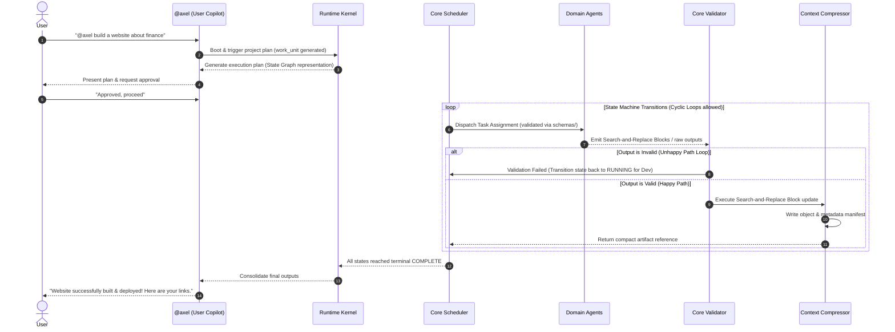

# LIEM: Enterprise Multi-Agent Orchestrator

Welcome to **LIEM**, a mass-scale, production-ready Multi-Agent system designed to automate the entire software development lifecycle (SDLC), business planning, data engineering, marketing, and security operations.

LIEM is built entirely on a **Declarative Agent Skill Model**. All agent behaviors, system prompts, operational protocols, and output formats are configured in clean, modular Markdown (`.md`) files. This allows the system to be engine-agnostic—any external LLM framework or custom parser can easily ingest these skills.

---

## 🏗️ Modular Core Architecture

To prevent context window bloat and single-point-of-failure issues, the system divides operations between a **Control Plane** and a **Data Plane**, managed by a central **Runtime Kernel**:

```text
                               +-------------------------------------+
                               |             User Input              |
                               +-------------------------------------+
                                                  |
                                                  v
                               +-------------------------------------+
                               |        @axel (User Copilot)         |
                               +-------------------------------------+
                                                  |
                                                  v
                               +-------------------------------------+
                               |            Runtime Kernel           |
                               |  (VRAM Offloading & Pub/Sub Event)  |
                               +-------------------------------------+
                                                  |
                     +----------------------------+----------------------------+
                     |                                                         |
                     v                                                         v
         [ CONTROL PLANE ]                                              [ DATA PLANE ]
    Planner ──> Router (Deterministic lookup)                         Executor (Sandbox & WAL DB)
                 ↓                                                             ↓
             Scheduler (Decaying Temp loop breaker)                         Providers (LLM/Storage)
                 ↓                                                             ↓
             Validator (JSON contracts & Pause-and-Resume)                  Artifacts (AST & Search/Replace Blocks)
```

### 1. The Runtime Kernel ([event_loop.md](file:///d:/Liem%20OS2/liem-os/kernel/event_loop.md))
The central engine that owns the system lifecycle (booting, executing event loops, checkpointing snapshots, and shut downs).
- **Model Offloading (Scale-to-Zero VRAM)**: To run on consumer hardware (e.g. 8GB VRAM), LLMs of suspended agents are dynamically unloaded to system RAM, freeing GPU slots for active ones.
- **Event-Driven Pub/Sub**: Prevents database polling loops; workers publish IPC/WebSocket events (`task.status.completed`) to instantly wake up the Scheduler.

### 2. The Control Plane (Coordination & Design)
- **User Copilot ([axel.md](file:///d:/Liem%20OS2/liem-os/agents/axel.md))**: Primary conversational interface.
- **Core Planner ([planner.md](file:///d:/Liem%20OS2/liem-os/agents/core/planner.md))**: Decomposes requests into work units.
- **Core Router ([router.md](file:///d:/Liem%20OS2/liem-os/agents/core/router.md))**: Resolves task capabilities to specific agent skills deterministically using YAML parsers on `registry/agents.yaml`.
- **Core Scheduler ([scheduler.md](file:///d:/Liem%20OS2/liem-os/agents/core/scheduler.md))**: Coordinates execution sequences using a **Reactive State Machine** for cyclic loops. Implements **Decaying Temperature & Loop Breakers** (loops limited to 5 retries, decaying temperature by 0.15 per retry to ensure convergence, escalating to model fallback, HITL, or re-planning).
- **Core Validator ([validator.md](file:///d:/Liem%20OS2/liem-os/agents/core/validator.md))**: Validates payloads against schemas under `schemas/` and manages **Pause-and-Resume State Hydration** (suspends states to disk and frees leases during HITL).

### 3. The Data Plane (Execution & Assets)
- **Core Executor ([executor.md](file:///d:/Liem%20OS2/liem-os/agents/core/executor.md))**: Runs tasks inside `sandbox/policy.yaml` boundaries, updating states asynchronously via a **Write-Ahead Logging (WAL)** database transaction model to prevent IO concurrency bottlenecks.
- **Context Compressor ([context_agent.md](file:///d:/Liem%20OS2/liem-os/agents/core/context_agent.md))**: Uses **AST (Abstract Syntax Tree) Chunking**, **Search-and-Replace Blocks**, and **AST Node ID Injections** to allow developer agents to edit code without line-number offset or patch hallucinations. Standard line-number-based Git patches are prohibited.
- **Recovery Manager ([recovery_agent.md](file:///d:/Liem%20OS2/liem-os/agents/core/recovery_agent.md))**: Manages circuit breakers (CLOSED, OPEN, HALF_OPEN) and fallbacks.


---

## 📂 Project Directory Structure

```text
LIEM/
│
├── src/                            # Fully implemented Python runtime driver
│   ├── main.py                     # System entrypoint & verification pipeline
│   ├── agents/                     # Base agent parsers & context compression
│   ├── kernel/                     # Event loop, scheduler, event bus, & VRAM offloader
│   └── storage/                    # Database interface & SQLite WAL state store
│
├── kernel/                         # Central execution engine & loop configs
│   ├── event_loop.md               # Boot, event loop, offloading, and recovery logic
│   ├── interfaces.yaml             # Execution and provider API specifications
│   └── admission.yaml              # SLA queues, priority triggers, and concurrency gates
│
├── agents/                         # Declarative Agent Skills (Markdown definitions)
│   ├── core/                       # Orchestration & System agents
│   ├── swe/                        # Software Engineering Domain
│   ├── research/                   # Research & Analysis Domain
│   ├── security/                   # Security Domain
│   ├── creative/                   # Content Creative Domain
│   ├── business/                   # Business Operations Domain
│   ├── support/                    # Customer Support & Ops Domain
│   ├── data/                       # Data Engineering & Analytics Domain
│   ├── hr/                         # HR & Talent Management Domain
│   ├── integration/                # Product Integration & Ecosystem Domain
│   └── pm_agile/                   # Project Management & Agile Domain
│
├── runtime/                        # Persistent execution state store
│   ├── executions/                 # State machine execution traces
│   ├── tasks/                      # Active task queues and lease locks
│   ├── locks/                      # Concurrency locks
│   └── snapshots/                  # Suspended state snapshots (Scale-to-Zero)
│
├── artifacts/                      # Structured artifact storage (manifest & objects)
│   ├── manifest.yaml               # Metadata layout for outputs
│   └── objects/                    # Bulky text/code objects stored physically
│
├── memory/                         # Isolated memory spaces (working, episodic, semantic, project)
│
├── registry/                       # Capability, lifecycle, and version maps
│
├── events/                         # Versioned, immutable event schemas
│
├── telemetry/                      # Logs, metrics, and cost allocation dashboards
│
├── audit/                          # Immutable, append-only history logs
│
├── maintenance/                    # Housekeeping and garbage collection routines
│
├── compatibility/                  # Version control compatibility rules
│
├── deploy/                         # Automated deployment guidelines
│
├── schemas/                        # Formal JSON validation schemas (task, artifact, work_unit)
│   ├── task.schema.json
│   ├── artifact.schema.json
│   ├── event.schema.json
│   └── work_unit.schema.json       # Structural schema for canonical work units
│
└── docs/                           # Master system documentation
    └── adr/                        # Architectural Decision Records (ADRs)
        ├── ADR-001-artifact-passing.md
        ├── ADR-002-sandbox-isolation.md
        ├── ADR-003-runtime-separation.md
        ├── ADR-004-cyclic-state-machine.md
        ├── ADR-005-ast-diff-patching.md
        ├── ADR-006-llm-friendly-search-replace.md
        └── ADR-007-model-offloading-vram.md
```

## 🚀 Getting Started & Workflow Guide

Follow this step-by-step guide to clone, configure, and build software from scratch using **Liem OS** and **Spec-Driven Development (SDD)**.

---

### Phase 1: Setup Liem OS (One-Time Setup)

First, clone and set up the orchestrator engine on your local machine:

1. **Clone the Liem OS repository**
   Use `npx degit` to fetch a clean template of the orchestrator:
   ```bash
   npx degit AxelS27/liem-os2 my-liem-os
   cd my-liem-os
   ```

2. **Bootstrap the Virtual Environment**
   Run the bootstrapping script to automatically set up the virtual environment (`.venv`) and install all dependencies:
   - **On Windows (1-Click Launch)**:
     Double-click the **`bootstrap.bat`** file in your file explorer.
   - **On macOS/Linux**:
     Run the Python script in your terminal:
     ```bash
     python bootstrap.py
     ```
   *(This creates the `.venv` folder, compiles the package, and installs specify-cli and other tools automatically).*

---

### Phase 2: Initialize a New Project Workspace

Once the orchestrator is ready, you can bootstrap a new workspace for any software project:

3. **Initialize New Project**
   Run the Liem OS CLI command to scaffold your new project. This automatically triggers `specify-cli` (GitHub Spec Kit) to set up the Spec-Driven Development templates, constitution, workflows, and agent skills:
   ```bash
   .venv\Scripts\liem-os init <project-name>
   cd <project-name>
   ```
   *(Note: For Unix/macOS, use `.venv/bin/liem-os` instead).*

4. **Start Engine & Dashboard GUI**
   To launch the visual dashboard and backend engine, simply do one of the following inside your project folder:
   - **Option A (1-Click Launch - Windows Explorer)**: 
     Double-click the auto-generated **`run.bat`** file inside the project folder.
   - **Option B (1-Click Launch - Unix/macOS)**: 
     Run **`./run.sh`** in the project folder.
   - **Option C (CLI Command)**: 
     Run the CLI start command:
     ```bash
     # On Windows
     ..\.venv\Scripts\liem-os start
     
     # On macOS/Linux
     ../.venv/bin/liem-os start
     ```
   *(This starts the FastAPI server and launches the PyWebView desktop application instantly).*

---

### Phase 3: Spec-Driven Development (SDD) Workflow

Once your project is initialized, you develop code using the integrated SDD commands via your coding assistant (Claude Code or Gemini/Antigravity):

5. **Define the Project Rules (Constitution)**
   Establish your project's technology stack, coding standards, and principles:
   - **Antigravity (Gemini)**: `/speckit.constitution`
   - **Claude Code**: `/speckit-constitution`
   *(This creates `CONSTITUTION.md` in your repository root).*

6. **Specify a New Feature (Specify)**
   Define your feature's functional requirements and user stories:
   - **Antigravity (Gemini)**: `/speckit.specify "Build <feature-description>"`
   *(This automatically creates a Git branch, creates `specs/[branch-name]/spec.md`, and prepares the directory).*

7. **Plan the Technical Implementation (Plan)**
   Deconstruct the specification into a concrete technical architecture blueprint:
   - **Antigravity (Gemini)**: `/speckit.plan`
   *(This generates `specs/[branch-name]/plan.md` detailing API schemas, databases, and test cases).*

8. **Generate the Actionable Task List (Tasks)**
   Compile the plan into a checklist task file:
   - **Antigravity (Gemini)**: `/speckit.tasks`
   *(This generates `specs/[branch-name]/task.md` outlining exact file edits).*

9. **Execute Code Changes (Implement)**
   Generate the actual code changes step-by-step based on the task checklist:
   - **Antigravity (Gemini)**: `/speckit.implement`

10. **Validate and Converge (Converge)**
    Run local unit tests to ensure everything is correct and secure before pushing:
    - **Antigravity (Gemini)**: `/speckit.converge`
    *(Once passed, push to GitHub where the GHA pipeline will run the final build validation!)*

## 🤖 Interacting with Axel (User Copilot)

**Axel** is your primary entrypoint, conversational copilot, and system gateway. When using the Liem OS Visual Dashboard, Axel orchestrates all background tasks and guides you through the execution steps.

### 1. How to Chat with Axel
- Launch the visual dashboard (using `run.bat` or `liem-os start`).
- Locate the **Chat Console** at the bottom of the screen.
- Type your commands directly (e.g. `@axel build a taxing module` or simple questions).

---

### 2. Conversational Queries vs. Task Execution

Axel operates in two distinct modes depending on your input:

#### A. Conversational Mode (General Inquiries)
If you ask informational questions or chat, Axel replies instantly without triggering background agents:
*   *Example:* `"Who are you?"` -> Axel will introduce himself and describe the orchestrator system roles.
*   *Example:* `"How is the system running?"` -> Axel will report telemetry, system health, and VRAM offloading stats.

#### B. Orchestration Mode (Agent Execution Triggers)
If you command Axel to build, audit, or research, he activates the Control Plane:
*   *Example:* `"Build a secure calculation backend."`
*   *Workflow*:
    1.  **Decomposition**: Axel triggers the **Core Planner** to generate a task execution plan.
    2.  **Plan Approval (HITL)**: Axel halts execution and displays a structured `LIEM EXECUTION PLAN` table in the chat window, prompting you to approve it.
    3.  **Task Routing**: Once approved, Axel coordinates the **Core Router** to dispatch tasks to active domain agents (e.g. `backend_agent`, `qa_agent`).
    4.  **Narration**: Axel outputs real-time log updates as specialists work (e.g., *"DevOps Agent has completed deployment setup, handing over to QA Agent..."*).

---

### 3. Directing Axel to Setup SDD
You can explicitly ask Axel to configure Spec-Driven Development (SDD) in your workspace if it hasn't been initialized:
*   *Command:* `"Axel, setup spec-driven development here."`
*   *Result*: Axel delegates this to the backend executor, which silently runs `specify init` to scaffold the `.claude/` and `.gemini/` configuration folders.

---


## 🔄 End-to-End Execution Workflow Example

For a complex request (e.g., *"@axel build a website about finance"*):



---

## ⚡ Key Architectural Rules

1.  **declarative-only**: All prompts, boundaries, and behaviors must be defined in markdown files (`.md`).
2.  **control-data-separation (P0)**: Control plane agents (Planner, Router, Scheduler, Validator) must never execute scripts or call tools directly; Data plane agents (Executor, Providers, Context Compressor) must never plan.
3.  **search-and-replace-blocks (P0)**: Leaf developer agents must output code modifications using exact **Search-and-Replace block matches** or **AST Node ID Injections**, preventing line-offset and patch hallucinations. Standard line-number-based Git patches are prohibited.
4.  **Pause-and-Resume Hydration (P1)**: Tasks waiting in the Human-in-the-Loop (HITL) queue must serialize their active execution state to `runtime/snapshots/` and **Scale-to-Zero** to release memory and scheduler leases.
5.  **WAL Database Transactions (P0)**: Workers and executors write state transitions directly to the database using Write-Ahead Logging (WAL) to avoid Scheduler I/O concurrency bottlenecks.
6.  **State Persistence (P0)**: All workflow transitions must be persisted instantly in `runtime/` to survive system restarts.
7.  **Idempotent Execution (P0)**: Every dispatch must attach an `idempotency_key` to prevent duplicate task execution upon retries.
8.  **Deterministic Configuration**: Runs must lock configurations (models, seeds, temperatures) in `execution/seed/` to guarantee pipeline output consistency.
9.  **Time UTC Standards**: All time-based operations, TTLs, and logs must strictly use the UTC timezone standard.
10. **Work Unit Execution (P0)**: All system executions must operate through structured, trace-correlated work units defined in `schemas/work_unit.schema.json`.
11. **VRAM Offloading (P0)**: Suspended agents must dynamically unload their model weights from GPU memory to host system memory to prevent out-of-memory errors on local hardware.
12. **Event-Driven Consolidation (P0)**: System state updates trigger immediate IPC/WebSocket messages to wake up the Scheduler loop, avoiding polling overheads.
